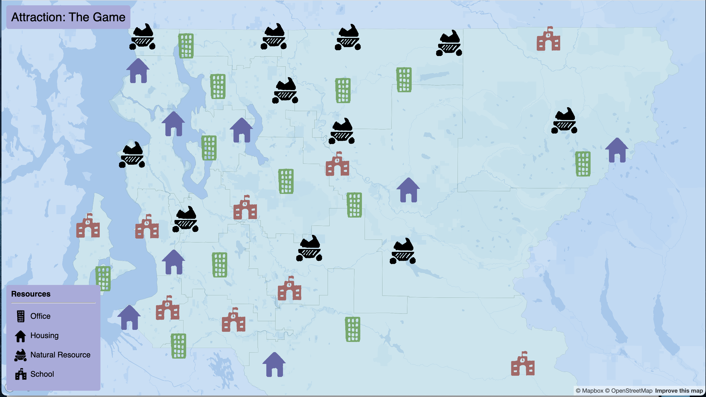

# Attraction: A GIS based game

## Project description

Attraction is a start to a little GIS game that is based around trying to make a
plot of land that a player chooses to be as attractive as possible through a
utility score. This score is calculated based on attributes that can be developed
through the gameplay such as jobs available, resources, and housing.

As of now, the project is completed with the setup process and the ability to view
the areas with each resource.

## Project goal

The goal of this project is to create a fun little simulation that will simulate the development
of an area through housing, jobs, education, and resources. Overall, the project isn't aiming to
be complicated so most of the simulation will be done with rough calculations. The
project aims to show some interesting ways to use GIS and provide a little game for the user in
the process.

## The application URL

[https://anemnox.github.io/GIS-Game/](https://anemnox.github.io/GIS-Game/)

## Screenshots

Here is a screenshot of the overall map created:

## Main functions

The main functions in this project currently are:
- Randomly generated resources per polygon features
- Hover over resource icons to get a description of them
- Hover over boundary polygons to get the stats of the area and reveal all available resources in the area

## Data sources

Data source for the boundary lines for WA school districts: [https://gisdata.kingcounty.gov/arcgis/rest/services/OpenDataPortal/district___base/MapServer/416](https://gisdata.kingcounty.gov/arcgis/rest/services/OpenDataPortal/district___base/MapServer/416)

## Applied libraries

Libraries that are used in this project:
- mapbox gl js
- basemap
- turfjs
- github

## Acknowledgment

Thank you to Prof. Bo Zhao and TA Stevan Bao for teaching the tools and skillsets to create this sort of map application and allowing creativity for this final project!
